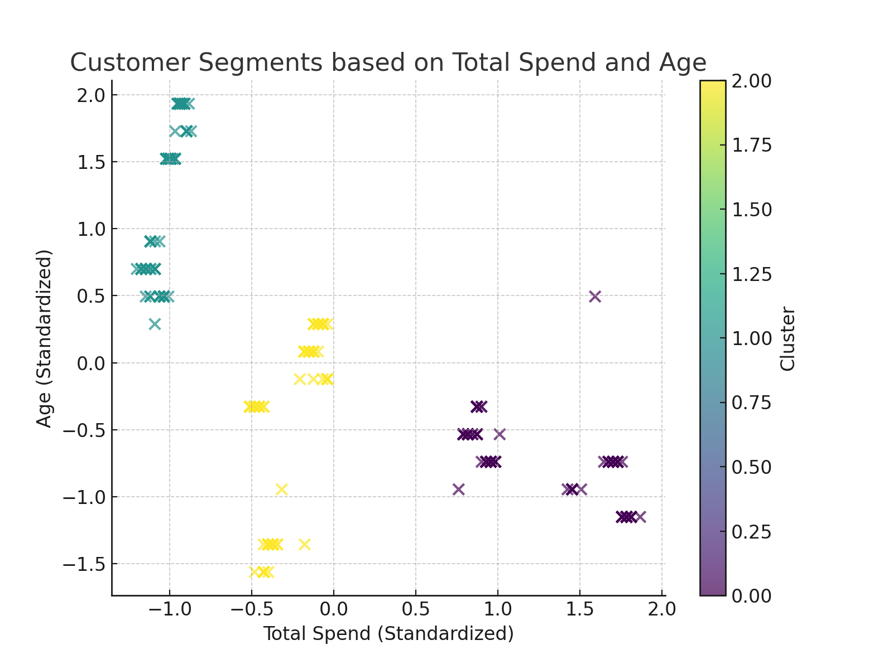

# Customer Segmentation for Targeted Marketing

## Project Overview
This project applies **K-means clustering** to segment customers into actionable groups based on purchasing behavior and demographic data. The purpose is to help businesses optimize their marketing strategies, improve campaign ROI, and better target specific customer segments.

## Objective
- Segment customers into distinct groups based on:
  - Demographic information (Age, Gender, Location, etc.)
  - Purchasing behavior (Total Spend, Items Purchased, Days Since Last Purchase)
- Identify actionable insights to improve targeted marketing efforts.

## Tools and Technologies Used
- **Programming Language**: Python
- **Libraries**: Pandas, Scikit-learn, Matplotlib, Seaborn
- **Machine Learning Technique**: K-means Clustering

## Dataset
The dataset includes the following customer attributes:
- `Customer ID`: Unique identifier for each customer.
- `Gender`: Customer gender.
- `Age`: Age of the customer.
- `City`: Customer's location.
- `Membership Type`: Customer membership tier (e.g., Gold, Silver).
- `Total Spend`: Total amount spent by the customer.
- `Items Purchased`: Number of items bought.
- `Days Since Last Purchase`: Recency of customer purchases.
- `Satisfaction Level`: Customer satisfaction level.

## Project Workflow
1. **Data Loading**: Load the dataset provided in CSV format.
2. **Data Preprocessing**:
   - Handle missing values (if any).
   - Encode categorical variables using Label Encoding.
   - Standardize numerical variables to ensure uniform feature scaling.
3. **Optimal Clusters**:
   - Use the **Elbow Method** to determine the optimal number of clusters.
4. **Clustering**:
   - Apply **K-means clustering** with the optimal number of clusters.
5. **Visualization**:
   - Visualize customer segments using a 2D scatter plot based on `Total Spend` and `Age`.
6. **Results**:
   - Save the clustered data to a CSV file.

## Results and Insights
- **3 Customer Segments Identified**:
   1. **High-Spending Frequent Buyers**: Loyal customers who can benefit from loyalty rewards.
   2. **Moderate Buyers**: Customers who respond well to targeted promotions.
   3. **Low-Spending Infrequent Buyers**: Customers who need re-engagement campaigns.

## Visualizations



## How to Run the Project
1. Clone the repository:
   ```bash
   git clone https://github.com/YourUsername/customer-segmentation.git
   cd customer-segmentation
